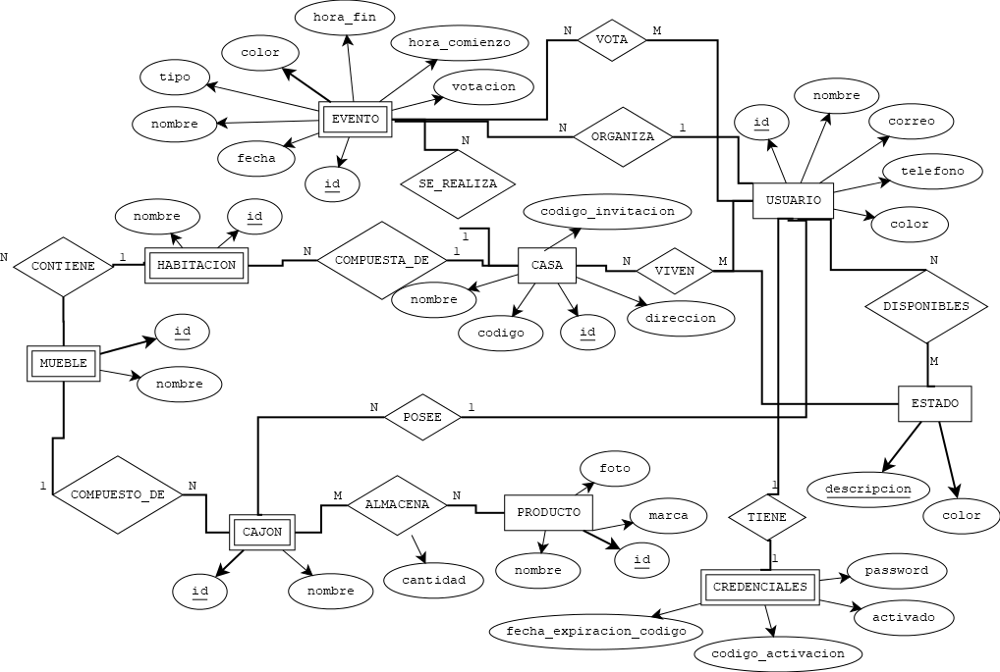
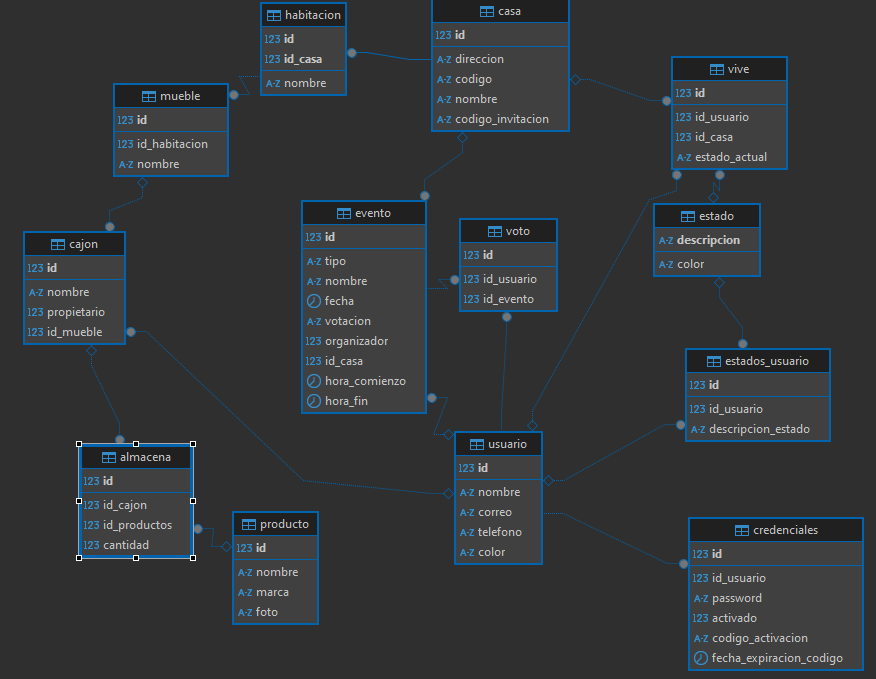
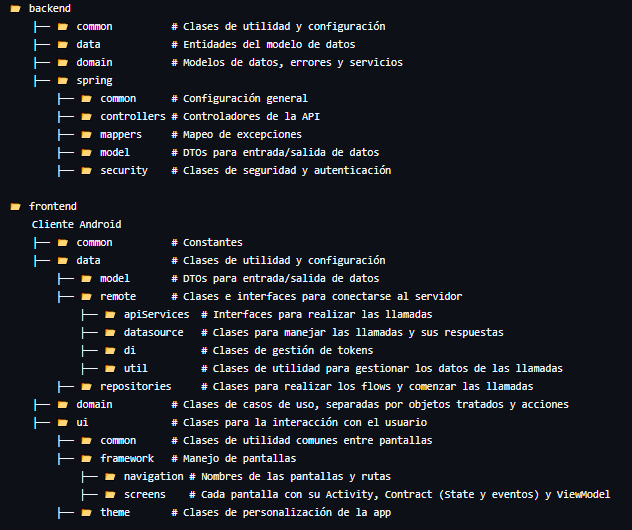

# **ATHOME - TFG**

## **Descripción del Proyecto**
ATHOME es una aplicación diseñada para mejorar la convivencia entre compañeros de piso mediante herramientas de organización y comunicación.  
Sus principales funcionalidades incluyen:  
- **Estados de Usuario**: Los miembros del hogar pueden establecer su estado (en casa, fuera, durmiendo) y visualizar el de otros para facilitar la convivencia.  
- **Reserva de Espacios**: Sistema para reservar zonas comunes, donde los miembros pueden votar para aceptar o rechazar una solicitud.  
- **Inventario Personalizado**: Gestión de inmuebles y productos almacenados, con control de acceso a los cajones por parte de sus propietarios.

---

## **Características Principales**
- **Web de Descarga**: Página web simple y atractiva para descargar el APK del cliente móvil.  
- **Seguridad Mejorada**: Uso de tokens con caducidad para autenticar al cliente móvil y proteger los datos.  
- **Privacidad Total**: Los propietarios de los cajones tienen acceso exclusivo a su contenido.  
- **Fácil de usar**: Usabilidad simple, interactiva e intuitiva para darle las mayores facilidades al usuario.

---

## **Tecnologías Aplicadas**

### **Frontend**
- **Vue.js**: Framework para construir la interfaz de la web de descarga.  
- **Axios**: Para manejar las llamadas a la API desde la web.  
- **Kotlin**: Desarrollo del cliente móvil con Jetpack Compose.  

### **Backend**
- **Spring Boot**: Framework utilizado para construir la API REST.  
- **Vue 3**: Utilizado para servir la web de descarga desde el servidor.  

### **Base de Datos**
- **SQL (DBeaver)**: Base de datos relacional diseñado desde un modelo Entidad-Relación.  

### **Infraestructura**
- **Docker**: Contenedores para facilitar el despliegue y la portabilidad del proyecto.  

### **Organización**
- **Taiga**: Página web donde se pueden realizar prácticas Scrum para organización de proyectos 
---

## **Arquitectura del Sistema**
- **Cliente Web**: Interfaz en Vue.js para la descarga del APK.  
- **Cliente Móvil**: Aplicación Android desarrollada en Kotlin con Jetpack Compose.  
- **Backend**: API REST en Spring Boot para la lógica del sistema.  
- **Base de Datos**: Sistema relacional basado en SQL para el almacenamiento de datos.  
- **Infraestructura con Docker**: Despliegue sencillo mediante contenedores.  

---

## **Bibliotecas utilizadas**
- **Spring Framework**: Boot, Web, Test, JPA, Validation, Security, Mail, Thymeleaf.  
- **Lombok**: Simplificación del código en el backend.  
- **MySQL Connector**: Integración con la base de datos.  
- **MapStruct**: Conversión entre entidades y DTOs.  
- **jsonwebtoken**: Gestión de tokens para autenticación.  
- **Glassfish Containers**: Contenedores de seguridad.  
- **Jakarta Web API**: Para facilitar el desarrollo web.  

---
## 🚀 Desarrollo

### 1️⃣ Diseño del Modelo de Datos  
Se comenzó diseñando el **modelo entidad-relación (E-R)** con la herramienta **DIA**, definiendo las entidades principales, sus atributos y las relaciones entre ellas (*1-N*, *N-M*, *1-1*).  
  

Tras validar el modelo E-R, se creó el **modelo de tablas** en **DBeaver**, estableciendo claves primarias y foráneas.  
  

Finalmente, se insertaron **datos de prueba** en la base de datos para verificar la estructura.

---

### 2️⃣ Desarrollo del Backend (Spring Boot)
Se implementó la base estructural del **servidor API-REST** con **Spring Boot**.  
#### 🔹 Configuración inicial:
- Se añadieron las **dependencias** necesarias en el `pom.xml`.
- Se crearon las clases de configuración:
  - `ConfigurationBeans` y `SecurityConfig` para la seguridad del sistema.
  - `JwtTokenFilter` y `UserDetailsServiceImpl` para la autenticación con JWT.
- Se implementaron clases de utilidad como `Security` y `TokensTools`.
- Se definieron **excepciones personalizadas** (`NOT_FOUND`, `UNAUTHORIZED`, `BAD_REQUEST`, etc.) y su mapeador.
- Se configuró el archivo `application.properties` para definir la conexión con la base de datos y otros ajustes.

#### 🔹 Arquitectura en Capas:
Se siguió un **modelo de capas**, organizando el código en las siguientes carpetas:
📂 backend
    ├── 📂 common          # Clases de utilidad y configuración
    ├── 📂 data            # Entidades del modelo de datos
    ├── 📂 domain          # Modelos de datos, errores y servicios
    ├── 📂 spring
        ├── 📂 common      # Configuración general
        ├── 📂 controllers # Controladores de la API
        ├── 📂 mappers     # Mapeo de excepciones
        ├── 📂 model       # DTOs para entrada/salida de datos
        ├── 📂 security    # Clases de seguridad y autenticación

📂 frontend
    ├── 📂 common          # Constantes
    ├── 📂 data            # Clases de utilidad y configuración
        ├── 📂 model       # DTOs para entrada/salida de datos
        ├── 📂 remote      # Clases e interfaces para conectarse al servidor
            ├── 📂 apiServices  # Interfaces para realizar las llamadas
            ├── 📂 datasource   # Clases para manejar las llamadas y sus respuestas
            ├── 📂 di           # Clases de gestión de tokens
            ├── 📂 util         # Clases de utilidad para gestionar los datos de las llamadas
        ├── 📂 repositories     # Clases para realizar los flows y comenzar las llamadas
    ├── 📂 domain          # Clases de casos de uso, separadas por objetos tratados y acciones
    ├── 📂 ui              # Clases para la interacción con el usuario
        ├── 📂 common      # Clases de utilidad comunes entre pantallas
        ├── 📂 framework   # Manejo de pantallas
            ├── 📂 navigation # Nombres de las pantallas y rutas
            ├── 📂 screens    # Cada pantalla con su Activity, Contract (State y eventos) y ViewModel
        ├── 📂 theme       # Clases de personalización de la app

 
            
   

Se implementaron las clases **entidad** siguiendo el modelo de datos, con sus anotaciones correspondientes.

---

### 3️⃣ Desarrollo de Funcionalidades
Cada funcionalidad se desarrolló en base a historias de usuario, aplicando **Scrum**.

#### 📌 **Ejemplo: Registro de Usuario**
##### 🖥️ **Backend**
1. Se creó el **`RegistroController`** para gestionar la llamada de registro.
2. Se definió el **DTO `RegistroRequestDTO`** para recibir los datos del usuario.
3. Se implementó el servicio **`UsuarioServicios`**, encargado de:
   - Crear y guardar la entidad `Usuario`.
   - Generar un código de activación con expiración.
   - Encriptar la contraseña con `Security`.
   - Guardar credenciales con `CredencialesRepository`.
   - Enviar el correo de activación con `MailService`.
4. Se probó la funcionalidad con **Postman** y **HTTP Requests**.

##### 🎨 **Frontend**
1. Se diseñó la pantalla de **Registro** en `RegistroActivity`, incluyendo:
   - Campos: nombre, contraseña, correo, teléfono y **ColorPicker**.
   - Botón de **Registrarse**.
2. Se implementó el **`RegistroState`** para manejar los datos ingresados.
3. Se creó el evento de **registro**, gestionado por `RegistroViewModel`, que:
   - Validó los campos y formateó los datos.
   - Llamó a `RegistroUseCase`, que gestionó la lógica del registro.
   - Enviando los datos al **servidor** a través de `UsuarioRemoteDataSource`.
4. Se realizó la llamada **HTTP POST** con `UsuarioService`, enviando el `RegistroRequestDTO`.
5. Se validaron los resultados, comprobando:
   - El envío correcto del correo de activación.
   - El almacenamiento adecuado del usuario en la base de datos.
6. Se realizaron pruebas de **conectividad** y **manejo de errores**, finalizando la tarea.

Este proceso se repitió para cada funcionalidad, asegurando una implementación estructurada y validada.

---

## **Requisitos**
### **Software Necesario**
- Node.js y npm  
- Java 17  
- Docker y Docker Compose  

---

## **Instalación**
### **Clonar el repositorio**
```bash
  git clone https://github.com/CarlosHernandezCR/AtHomeTFG.git
```

### **Ejecutar con Docker**
Descargar el servidor desde DockerHub:
```bash
  docker pull carloshernandezcr/inhometfg:latest
```
Iniciar el contenedor:
```bash
  docker-compose up
```
Acceder al Cliente Web
Visitar: http://localhost:8889
